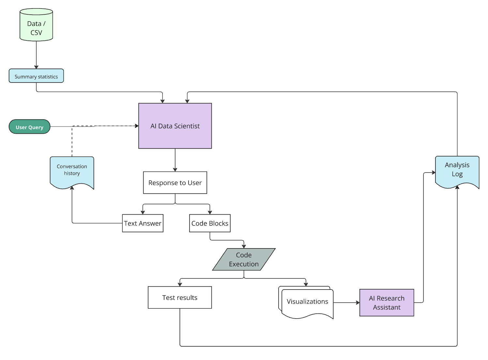

# AI Data Scientist

AI Data Scientist is an approach towards conversational, open-sourced Data Science analysis. Leveraging the power of LLMs and natural language to democratize data insights.

**Video Demonstration**
<details>
<summary>▶️ Video Demonstration</summary>

https://github.com/user-attachments/assets/c5eb68bc-1dc0-493b-ab22-4abf6a882846

</details>

## Live Demo
The application is deployed and accessible at:
- Frontend: https://nicozumarraga.github.io/ai-data-scientist
- Backend API: https://ai-data-scientist-1.onrender.com

### LLM Architecture


## Features

- **Conversational Data Analysis**: Engage with your data through natural language queries, making analysis more intuitive.
- **Automatic Visualizations**: Generates relevant charts and plots based on the context of questions and previous insights.
- **Persistent Context**: Maintains context across queries, allowing for seamless and continuous data exploration.
- **Research Assistant Log**: A second AI Agent reads through all visualizations and logs insights, details as well as /10 ranking of the visual.
- **AI Report Generation**: Based on conversation history and the RA logs, summarizes a coherent document with visuals into LaTeX PDF.
- **LaTeX / PDF Export**: Creates well-structured PDF reports that summarize the analysis session.

## Applications

- **Industry Professionals**: Industry experts with little data science knowledge looking to visualize and extract insights from their data.
- **Data Scientists**: Data Scientists looking for fresh ideals into plot visualization, feaature engineering or fast Exploratory Data Analysis.
- **Educational**: Learn Data Science through hands-on examples and real-time dataset manipulation and visualization.

## Technology Stack

### Backend
- **FastAPI**: Serves as the backend framework, ensuring high performance and scalability.
- **Claude AI**: Provides the AI-powered analysis and conversational understanding.
- **Pandas & NumPy**: Libraries for data manipulation and numerical processing.
- **Matplotlib & Seaborn**: Used for creating visualizations.
- **LaTeX**: Enables the generation of high-quality PDF reports.

### Frontend
- **React**: Used for building the UI components, offering an interactive experience.
- **Tailwind CSS**: Ensures responsive, modern, and consistent styling.
- **Shadcn UI Components**: Provides a sleek UI kit for enhanced usability and aesthetics.
- **Real-Time Visualization**: Dynamic code execution and visualization allow for immediate feedback.

## Installation

### Prerequisites
- **Python**: Version 3.8 or higher
- **Node.js**: For the frontend, with `npm` for package management
- **LaTeX Distribution**: Required for report generation (TinyTeX is recommended)

### System Dependencies

#### MacOS
```bash
# Install TinyTeX for LaTeX support
brew install --cask tinytex

# Install necessary LaTeX packages
tlmgr install listings float hyperref graphics ec latex-bin hyphen-base
```

#### Ubuntu/Debian
```bash
sudo apt-get install texlive-latex-base texlive-fonts-recommended texlive-fonts-extra texlive-latex-extra
```

## Backend Setup

1. **Clone the repository**:
  ```bash
   git clone https://github.com/yourusername/ai-data-scientist.git
   cd ai-data-scientist
   ```

2. **Create and activate virtual environment:**
  ```bash
  python -m venv venv
  source venv/bin/activate  # On Windows: venv\Scripts\activate
  ```

3. **Install Python dependencies:**
  ```bash
  pip install -r requirements.txt
  ```

4. **Create `.env`file in the backup directory:**
  ```env
  # Required
  ANTHROPIC_API_KEY=your_api_key_here

  # Optional - defaults shown
  MODEL_NAME=claude-3-5-sonnet-20241022
  MAX_TOKENS=1096
  TEMPERATURE=0.3
  ENVIRONMENT=development
  CORS_ORIGINS=*
  ```

## Frontend Setup

1. **Install dependencies:**:
  ```bash
  cd frontend
  npm install
   ```

2. **Create `.env` file:**
  ```env
  VITE_API_URL=http://localhost:8000
  ```

## Running the application

1. **Start the backend server:**
  ```bash
  cd backend
  uvicorn app.main:app --reload
  ```

2. **In a new terminal, start the frontend:**
  ```bash
  cd frontend
  npm start
  ```
3. **Open your browser and navigate to `https://localhost:3000`**

## Usage Guide

1. **Data Upload**
- Upload your CSV file using the upload interface
- View automatic data summary and statistics

2. **Data Analysis**
- Ask questions about your data in natural language
- Get visualizations and statistical insights
- View and interact with generated code

*The AI Data Scientist can both visualize and fit predictive models to data*

3. **Report Generation**
- Click "Generate AI Report" to create a comprehensive PDF report
- Reports include visualizations and insights from your analysis session

## Deployment (Optional)

### Backend (Render.com)
1. Create a new Web Service in Render.com
2. Connect your GitHub repository
3. Configure as a Docker service:
   - Root Directory: `backend`
   - Environment: Docker
   - Docker Command: `uvicorn app.main:app --host 0.0.0.0 --port $PORT`
4. Add environment variables:
   - `ANTHROPIC_API_KEY`
   - `MODEL_NAME`

### Frontend (GitHub Pages)
1. Create `.env.local` with your production backend URL:
   ```env
   VITE_API_URL=https://your-render-backend-url
   ```
2. Deploy yo GitHub pages
  ```bash
  cd frontend
  npm run deploy
  ```

## Project Structure
```
.
├── backend/
|   ├── Dockerfile
│   ├── app/
│   │   ├── services/
│   │   │   ├── data_service.py
│   │   │   ├── llm_service.py
│   │   │   ├── plot_analysis_service.py
│   │   │   └── report_service.py
│   │   ├── templates/
│   │   │   └── report_template.tex
│   │   ├── logs/
│   │   │   └── analysis_log.json
│   │   ├── reports/
│   │   ├── models.py
│   │   ├── config.py
│   │   └── main.py
│   └── .env
├── frontend/
│   ├── public/
│   │   └── index.html
│   ├── src/
│   │   ├── components/
│   │   │   ├── AnalysisResult.js
│   │   │   ├── CodeBlock.js
│   │   │   ├── DataSummary.js
│   │   │   ├── FileUpload.js
│   │   │   ├── QueryInput.js
│   │   │   └── ReportButton.js
│   │   ├── App.js
│   │   ├── index.js
│   │   ├── tailwind.config.js
│   │   ├── postcss.config.js
│   │   ├── webpack.config.js
│   │   └── .babelrc
│   ├── package.json
│   ├── package-lock.json
├── requirements.txt
├── LICENSE
└── README.md

```

## Environment Variables

| Variable            | Description             | Default                   |
|---------------------|-------------------------|---------------------------|
| `ANTHROPIC_API_KEY` | Your Anthropic API key  | Required                  |
| `MODEL_NAME`        | Claude model to use     | `claude-3-5-haiku-20241022` |

## Future Enhancements

- [ ] Support for multiple file formats
- [ ] Support for multiple LLMs
- [ ] Multiple chats interface and cache
